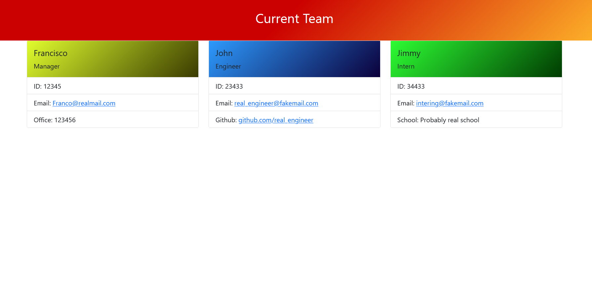

# 10-Assignment-User-Checker
Generates a web page with basic info of the interested party. 

# Team Viewer
[](https://opensource.org/licenses/MIT)
## Description
An app that generates cards of your team members
## Table of Contents 
- [Installation](#installation)
- [Usage](#usage)
- [License](#license)
- [Contributing](#contributing)
- [Tests](#tests)
- [Questions](#questions)
## Installation
To install necessary dependencies, follow the next steps and run these commands:
```bash
npm install inquirer and have node installed
```
## Usage
Generate a simple team viewer to add a few members of your organization to for quick access. 

## License
    
  Copyright <YEAR> <COPYRIGHT HOLDER>
  Permission is hereby granted, free of charge, to any person obtaining a copy of this software and associated documentation files (the "Software"), to deal in the Software without restriction, including without limitation the rights to use, copy, modify, merge, publish, distribute, sublicense, and/or sell copies of the Software, and to permit persons to whom the Software is furnished to do so, subject to the following conditions:
  The above copyright notice and this permission notice shall be included in all copies or substantial portions of the Software.
  THE SOFTWARE IS PROVIDED "AS IS", WITHOUT WARRANTY OF ANY KIND, EXPRESS OR IMPLIED, INCLUDING BUT NOT LIMITED TO THE WARRANTIES OF MERCHANTABILITY, FITNESS FOR A PARTICULAR PURPOSE AND NONINFRINGEMENT. IN NO EVENT SHALL THE AUTHORS OR COPYRIGHT HOLDERS BE LIABLE FOR ANY CLAIM, DAMAGES OR OTHER LIABILITY, WHETHER IN AN ACTION OF CONTRACT, TORT OR OTHERWISE, ARISING FROM, OUT OF OR IN CONNECTION WITH THE SOFTWARE OR THE USE OR OTHER DEALINGS IN THE SOFTWARE.
  For more information, visit (This project is licensed under the MIT license)
  
  
## Contributing
Contribute and use as you need
## Tests
To run tests, run the following command:
```bash
node and your file
```
screenshot  
link to repository (https://github.com/NA-Ag/10-Assignment-User-Checker)
link to video (https://drive.google.com/file/d/1nhm_JwLHhIziACgi8M1WUuBw73Yx00r5/view)
